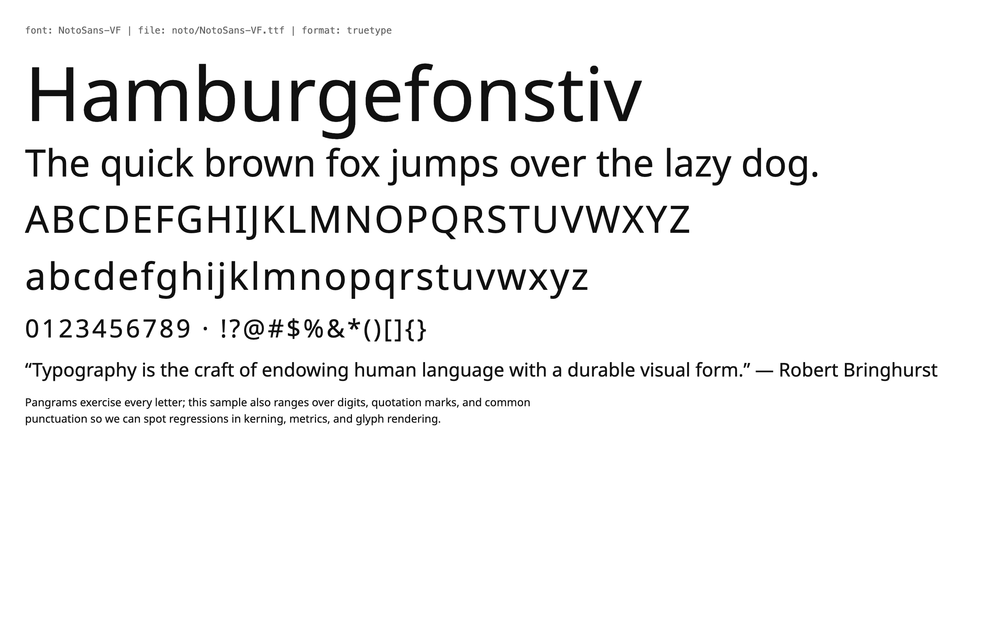
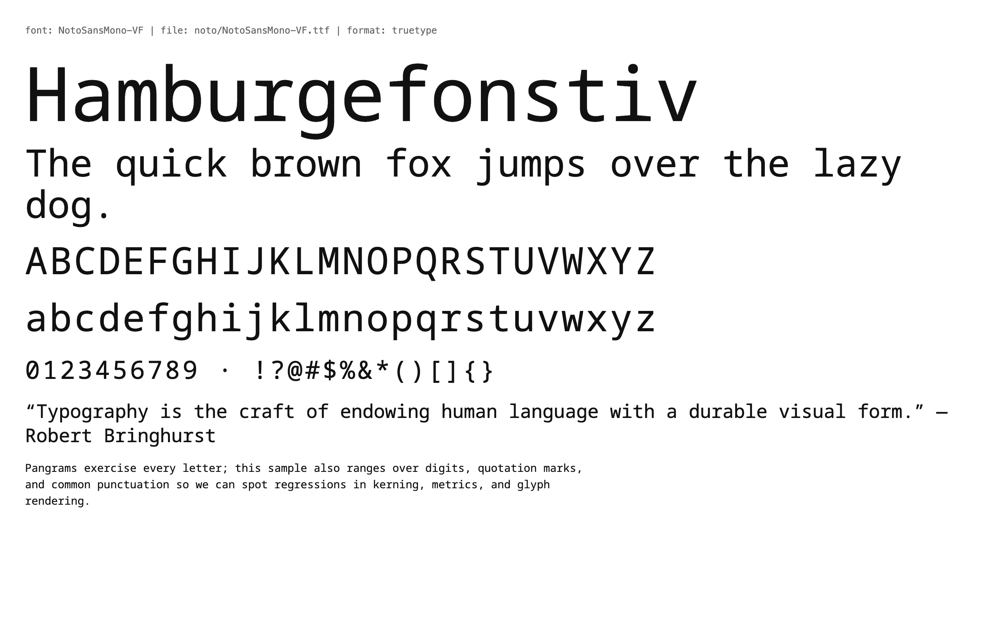
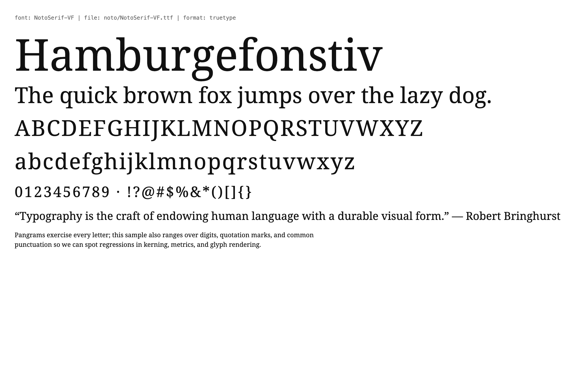
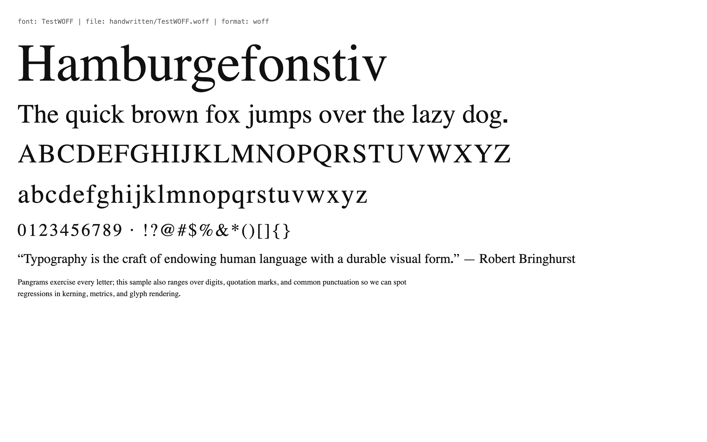

# proto-font

## Instructions

Make sure you create a setup.sh, build.sh, test.sh, and LET_IT_RIP.sh that contain all project setup scripts/commands used - NEVER build/test/run the code in this repo outside of these scripts, NEVER commit or push without running these either. Make them idempotent so that each build.sh can run setup.sh and skip things already set up, each test.sh can run build.sh, each LET_IT_RIP runs test.sh

use go1.26

Encode the latest versions of the OpenType, TrueType, and woff font formats into protobuf messages, similarly to how we did it in this project: https://github.com/accretional/mime-proto/blob/main/pb/proto/openformat/v1/docx.proto

try to use protos you find in https://github.com/google/fonts if they are related to the font formats or Noto, we are going to set upa. validation/test set with all the noto fonts https://github.com/google/fonts/blob/b669b896a75927719f611ac76f329bbeab32dc61/lang/Lib/gflanguages/languages_public.proto https://github.com/google/fonts/blob/b669b896a75927719f611ac76f329bbeab32dc61/axisregistry/Lib/axisregistry/axes.proto

here's some stuff from other repos

<details><summary>googlefonts files with .proto, mangled formatting, try github googlefonts/gftools or similar</summary>
17 files  (568 ms)
17 files
in
googlefonts (press backspace or delete to remove)
Files with identical content are grouped together.
googlefonts/gftools · Lib/gftools/axes.proto

    Protocol Buffer
    ·
    0 (0)

syntax = "proto2";
// GF Axis Registry Protos
// An axis in the GF Axis Registry
message AxisProto {
  // Axis tag
  optional string tag = 1;
googlefonts/PFE-analysis · analysis/result.proto

    Protocol Buffer
    ·
    0 (0)

// Proto definition of used to store the results of
// the analysis.
syntax = "proto3";
package analysis;
message AnalysisResultProto {
googlefonts/gftools · Lib/gftools/designers.proto

    Protocol Buffer
    ·
    0 (0)

syntax = "proto2";
// GF Designer Profile Protos
// A designer listed on the catalog:
message DesignerInfoProto {
  // Designer or typefoundry name:
  optional string designer = 1;
googlefonts/gf-metadata · resources/protos/designers.proto

googlefonts/gf-metadata · resources/scripts/embed_data.proto

    Protocol Buffer
    ·
    0 (0)

syntax = "proto2";
message FloatVecProto {
    repeated float value = 1;
}
message MetadataProto {
googlefonts/PFE-analysis · analysis/pfe_methods/unicode_range_data/slicing_strategy.proto

    Protocol Buffer
    ·
    0 (0)

syntax = "proto3";
package analysis.pfe_methods.unicode_range_data;
message SlicingStrategy {
  repeated Subset subsets = 1;
}
googlefonts/gftools · Lib/gftools/fonts_public.proto

    Protocol Buffer
    ·
    0 (0)

syntax = "proto2";
/**
 * Open Source'd font metadata proto formats.
 */
package google.fonts_public;
googlefonts/gf-metadata · resources/protos/fonts_public.proto

googlefonts/lang · Lib/gflanguages/languages_public.proto

    Protocol Buffer
    ·
    0 (0)

syntax = "proto2";
/**
 * languages/regions/scripts proto formats.
 */
package google.languages_public;
googlefonts/gf-metadata · resources/protos/languages_public.proto

googlefonts/FontClassificationTool · fonts_public.proto

    Protocol Buffer
    ·
    0 (0)

syntax = "proto2";
/**
 * Open Source'd font metadata proto formats.
 */
package google.fonts;
googlefonts/gf-metadata · resources/protos/axes.proto

    Protocol Buffer
    ·
    0 (0)

syntax = "proto2";
// GF Axis Registry Protos
// An axis in the GF Axis Registry
message AxisProto {
  // Axis tag
  optional string tag = 1;
googlefonts/PFE-analysis · analysis/page_view_sequence.proto

    Protocol Buffer
    ·
    0 (0)

// Proto format used by the open source incxfer analysis code.
syntax = "proto3";
package analysis;
message PageContentProto {
  string font_name = 1;
googlefonts/gftools · Lib/gftools/knowledge.proto

    Protocol Buffer
    ·
    0 (0)

syntax = "proto2";
/**
 * Proto definitions for Fonts Knowledge metadata in the filesystem.
 */
package fonts;
googlefonts/gf-metadata · resources/protos/knowledge.proto

googlefonts/fontbakery-dashboardArchived · containers/base/protocolbuffers/shared.proto

    Protocol Buffer
    ·
    0 (0)

syntax = "proto3";
package fontbakery.dashboard;
message File {
  string name = 1;
  bytes data = 2;
googlefonts/fontbakery-dashboardArchived · containers/base/protocolbuffers/messages.proto

    Protocol Buffer
    ·
    0 (0)

syntax = "proto3";
import "google/protobuf/any.proto";
import "google/protobuf/timestamp.proto";
import "google/protobuf/empty.proto";
import public "shared.proto";

</details>

do the same in https://github.com/googlefonts/axisregistry

get the fonts out of https://github.com/google/material-design-icons

document and build a client for the google fonts api with documentation at https://developers.google.com/fonts/docs/developer_api#api_url_specification 

integrate https://github.com/googlefonts/lang

Do this

```
you can download all Google Fonts in a simple ZIP snapshot (over 1GB) from https://github.com/google/fonts/archive/main.zip
Sync With Git

You can also sync the collection with git so that you can update by only fetching what has changed. To learn how to use git, GitHub provides illustrated guides, a youtube channel, and an interactive learning site. Free, open-source git applications are available for Windows and Mac OS X.
```

Go through https://developers.google.com/fonts/faq and document anything interesting in docs/googlefaq-tldr.md

do the same in https://googlefonts.github.io/gf-guide/ document it in docs/gf-guide-tldr.md

Do the same with https://github.com/orgs/googlefonts/repositories, don't go crazy importing random fonts there tho, docs/googlefonts-repos-tldr/

do 

## Project layout

See `AGENTS.md` / `CLAUDE.md` for the ground rules. Quick map:

- `proto/openformat/v1/` — authored proto sources, one file per
  subsystem (`container`, `sfnt_table`, `tables_core`, plus stub
  files for the table groups still waiting on gluon).
- `proto/googlefonts/v1/` — vendored upstream protos (gftools, lang).
- `gen/go/` — generated Go; do not hand-edit. One Go package per
  proto area.
- `internal/fontcodec/` — Decode/Encode for SFNT, WOFF1, WOFF2 (header-only),
  TTC, EOT.
- `internal/metadata/` — parses google/fonts `METADATA.pb` text-protos.
- `internal/gfapi/` — Google Fonts developer-API client. See `docs/gfapi.md`.
- `data/fonts/` — fixtures; `noto/` is fetched by `setup.sh`,
  `gfonts/` is the opt-in full corpus, `handwritten/` is checked in.
- `testing/` — validation, fuzz, benchmarks.
- `ui-e2e-validation/` — generates per-font HTML samples + chromerpc
  automation textprotos; drives headless Chrome under `UI_E2E=1`.
- `docs/` — TL;DRs for the FAQ, contributor guide, per-repo notes.

## Build / test

Do everything through the scripts:

```
./setup.sh       # install deps, vendor protos, generate Go, fetch fixtures
./build.sh       # setup + go vet + go build
./test.sh        # build + unit/validation/fuzz smoke/bench
./LET_IT_RIP.sh  # test. ship gate.
```

### Full Google Fonts corpus (opt-in)

The default setup pulls ~3 Noto TTFs + 7 `METADATA.pb` files (seconds).
Set `SETUP_FULL=1 ./setup.sh` to shallow-clone the entire `google/fonts`
repo into `data/fonts/gfonts/` (~1 GB, uses `--filter=blob:none`).
Re-runs fetch incrementally. Pin to a commit via `GFONTS_COMMIT=<sha>`.

Once the corpus is on disk, run the sweeps with `FULL_CORPUS=1`:

```
FULL_CORPUS=1 go test ./testing/validation/...  -run FullCorpus
FULL_CORPUS=1 go test ./internal/metadata/...   -run FullCorpus
```

The default `./test.sh` skips `data/fonts/gfonts/` so CI stays fast.

## UI validation samples

`ui-e2e-validation/` renders every font under `data/fonts/` with
`@font-face` in headless Chrome (via
[accretional/chromerpc](https://github.com/accretional/chromerpc)) and
screenshots the page. Committed reference renders:

| Family               | Sample                                                      |
| -------------------- | ----------------------------------------------------------- |
| Noto Sans VF         |            |
| Noto Sans Mono VF    |   |
| Noto Serif VF        |          |
| TestOTF (fonttools)  |                     |
| TestWOFF (fonttools) |                   |
| TestWOFF2 (fonttools)|                 |

(`.ttc` and `.eot` are skipped — browsers don't load them via
`@font-face`.)

Regenerate with:

```sh
# Start chromerpc (sibling repo) then:
UI_E2E=1 go test ./ui-e2e-validation/...
# To keep the PNGs (instead of in t.TempDir):
UI_E2E=1 SCREENSHOT_OUT_DIR=docs/screenshots go test ./ui-e2e-validation/...
```

Each automation textproto sets a 1280×800 viewport at `device_scale_factor=2`,
navigates to the generated sample page, waits 500 ms for `@font-face` to
resolve, and writes a full-page PNG. See `ui-e2e-validation/README.md`.

## NEXT STEPS

Findings and known gaps surfaced while building the codec / schema.
Append as new work comes up.

- **WOFF2 decode** *(structural pass + glyf transform reversal landed)*:
  header, variable-length table directory (UIntBase128 per spec §6.1.1),
  and brotli-decompressed per-table bytes are on
  `Woff2TableDirectoryEntry.data`. The glyf transform (spec §5.1) is
  reversed into plain SFNT glyf + loca bytes on
  `Woff2TableDirectoryEntry.untransformed_data` (populated on both the
  `glyf` and `loca` entries). WOFF2 collections (`flavor == 'ttcf'`) are
  still explicitly rejected. Brotli dep:
  `github.com/andybalholm/brotli` (see `CLAUDE_BLOOD_PACT.md`).
- **WOFF2 encode from structured fields** *(landed)*: `encodeWOFF2`
  rebuilds the container from `Woff2Font`. When a `glyf` entry carries
  `untransformed_data` but empty `data`, the encoder synthesises the
  spec §5.1 transform (seven sub-streams + optional overlap bitmap)
  from the SFNT glyf + loca via `synthesizeWoff2Glyf`. `loca` is
  emitted zero-length as the spec requires. Structural round-trip
  (decode→encode→decode) is covered by
  `TestWOFF2EncodeRoundTrip`; byte-exact vs the original is not a
  goal since brotli is non-deterministic across encoders.
- **TTC synthesis** *(landed)*: `encodeTTC` lays out the TTC header +
  per-font offset tables + **deduplicated** shared table bodies.
  Identical `SfntTable.raw_data` across fonts is written once, so the
  typical CJK "multiple weights sharing glyf" layout re-collapses on
  synthesis. v2 DSIG data is placed at the end when present.
  `head.checkSumAdjustment` is preserved verbatim per OpenType §2.2
  (the value is "ignored" in collections). Covered by
  `TestTTCEncodeRoundTrip`.
- **EOT synthesis** *(landed)*: `encodeEOT` rebuilds the 36-byte
  little-endian header + variable-length trailing header bytes + opaque
  font body. Byte-exact round-trip via `TestEOTEncodeRoundTrip`.
- **cmap subtable parsing** *(landed — formats 0, 4, 6, 10, 12, 13, 14)*:
  the decoder now fills `CmapEncodingRecord.parsed_subtable` with a
  format-specific message (segment arrays for fmt4, range groups for
  fmt12/13, UVS records for fmt14, etc.) alongside the existing opaque
  `subtable_bodies` map. Round-trip still re-emits from
  `subtable_bodies`, so editing the parsed view does NOT affect bytes.
  Follow-up: format 2 (high-byte CJK mapping) and format 8 (mixed
  16/32-bit) are still unrecognised — no NotoSans fixture exercises
  them today.
- **`head.checkSumAdjustment` recompute** *(landed)*: `encodeSFNT`
  zeroes the field, sums every uint32 word across the whole laid-out
  file, and writes `0xB1B0AFBA − sum` back. The head table's own
  directory checksum is also computed with `checkSumAdjustment` zeroed
  per OpenType §5.head. Only runs in the synthesis path — the
  `raw_bytes` short-circuit in `Encode` still guarantees byte-exact
  output for decoded files. Covered by
  `TestHeadCheckSumAdjustmentRecompute`.
- **Structured parsers for currently-stubbed tables**: the proto
  schema now reserves typed messages for `glyf`, `CFF`, `CFF2`, `GSUB`,
  `GPOS`, `GDEF`, `BASE`, `JSTF`, `MATH`, `fvar`, `avar`, `STAT`,
  `HVAR`, `VVAR`, `MVAR`, `gvar`, `COLR`, `CPAL`, `sbix`, `CBDT`,
  `CBLC`, `SVG`, `EBDT`, `EBLC`, `EBSC`, `vhea`, `vmtx`, `kern`,
  `hdmx`, `LTSH`, `VDMX`, `gasp`, `PCLT`, `meta`, `DSIG`, `MERG`,
  `VORG`, `cvt`, `fpgm`, `prep`. The messages are intentionally empty
  — bytes still live in `SfntTable.raw_data` — and the **gluon**
  parser project will fill them in as parsers land. Adding fields is
  backward-compatible.
- **`METADATA.pb` ingestion** *(done — see `METADATA-IMPORT-LOG.md`)*:
  `internal/metadata` parses + validates the text-protos from
  `google/fonts`, and the three follow-ups have now landed:
  - `CheckFilenames` / `CheckFamilyDir` cross-check each METADATA
    `fonts[*].filename` against the real `.ttf`/`.otf` binaries in the
    family directory, reporting resolved/missing/orphan sets into a
    `FamilyFilenameCheck` proto.
  - `LoadDescription` reads `DESCRIPTION.en_us.html` and returns a
    `FamilyDescription` with raw HTML + best-effort plain text.
  - `LoadAxisRegistry` parses every `.textproto` under
    `axisregistry/Lib/axisregistry/data/` into the vendored
    `googlefonts.AxisProto`.
  The corpus-backed tests (`TestCheckFilenamesCorpus`,
  `TestLoadDescriptionCorpus`, `TestLoadAxisRegistry`) run against the
  `SETUP_FULL=1` google/fonts clone and skip when it's absent.
- **Material Design Icons ingestion** *(landed — fixtures pulled by setup.sh
  into `data/fonts/material-symbols/`)*: three Material Symbols variable
  TTFs (Outlined / Rounded / Sharp, four-axis FILL+GRAD+opsz+wght) plus
  a real-world WOFF2 (Outlined). Auto-included by the validation sweep
  + benchmarks; round-trip parity holds for all four. They stress the
  variation tables (`fvar`/`avar`/`STAT`/`HVAR`/`MVAR`/`gvar`) much
  harder than the two-axis Noto fixtures and give us our first
  non-fonttools-test WOFF2. Follow-up: a colour-table sample
  (`COLR`/`CPAL`) is still missing — Material Symbols is monochrome.
- **`lang` data files**: we vendor the schema, not the `.textproto` data.
  If `gfapi` gains a "fonts covering language X" helper we need to pull
  the data.
- **Handwritten fixtures** *(seeded — five non-TTF samples now committed under
  `data/fonts/handwritten/`)*: `TestOTF.otf`, `TestTTC.ttc`, `TestWOFF.woff`,
  `TestWOFF2.woff2` from
  [fonttools](https://github.com/fonttools/fonttools/tree/main/Tests/ttx/data)
  (MIT) and `fontawesome-webfont.eot` from
  [Font Awesome 4](https://github.com/FortAwesome/Font-Awesome/tree/4.x/fonts)
  (font OFL-1.1, code MIT) — they exercise the OTF, TTC, WOFF1, WOFF2, and
  EOT decode paths byte-exact. Future additions: a WOFF with metadata-XML,
  a real-world `Source Han` TTC, a colour-table sample (`COLR`/`CPAL`
  Bungee or Twemoji).
- **Font Bakery parity**: we don't run Font Bakery in CI; the validation
  suite only checks byte-exact round-trip + `head.magicNumber`. Wiring in
  `fontbakery check-googlefonts` on the Noto fixtures would catch codec
  regressions that re-emit "valid-but-Different" bytes.

